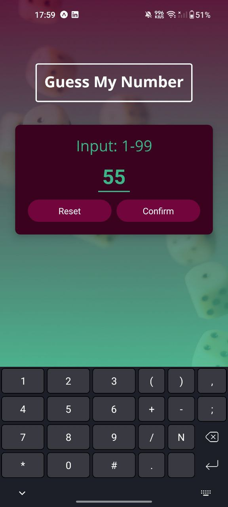
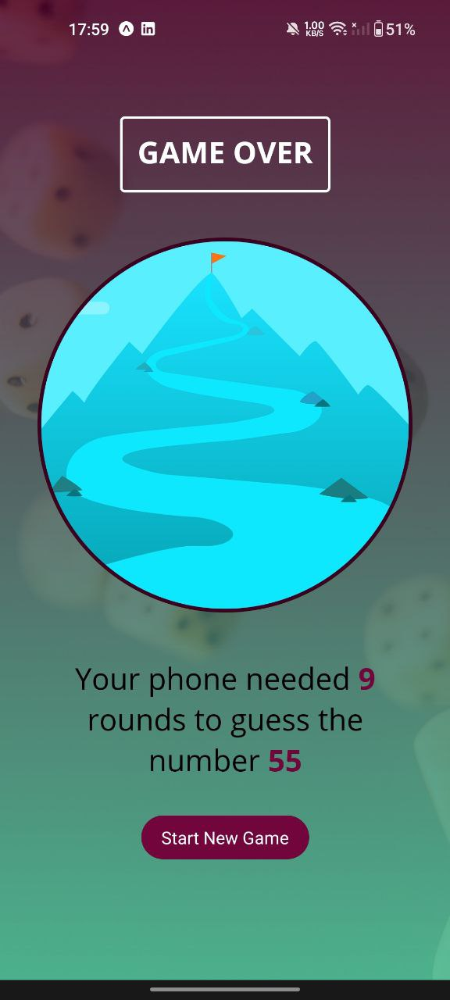
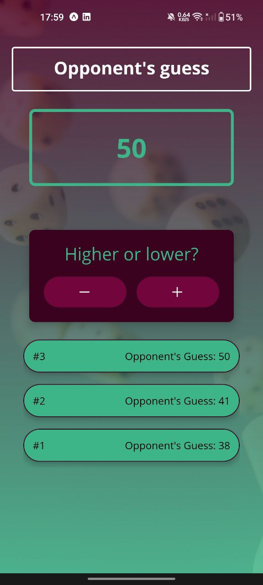

# Number Guesser Mobile Game

  
  
  

Greetings, earthlings! Prepare for a game that's out of this world. I present to you, the **Number Guesser**, an application that personifies the ultimate showdown between human intuition and artificial intelligence. This game was brewed with the magical essence of React Native to deliver a stellar cross-platform mobile experience. So, do you think you can outsmart your phone?

## Features

- **Slick and Sleek**: An interface so smooth, it could be mistaken for a hot knife cutting through butter.
- **Diverse Gameplay**: Same game, different experience every time. The thrill of unpredictability is alive!
- **Replayability? Check!**: If you think your phone's too smart, challenge it again, and make it sweat!

## How To Play

1. **Picking the Battle Number**: In the `StartGameScreen`, input your chosen number (between 1 and 99). We've ensured you can't cheat the system. We're watching you 👀
2. **Bring It On!**: The `GameScreen` jumps into action, kickstarting your phone's guessing journey. The tension builds. Will the phone go high? Will it go low? Only the RNG gods know.
3. **Guide your humble phone**: Help your phone out by letting it know if its guess was too high or too low. But remember, honesty is the best policy, and our cheat-detection technology is top-notch.
4. **The Grand Finale**: The `GameOverScreen` pops up once your phone finally guesses your number, revealing the number of attempts it made along with your original number.

## Deployment

The game is under active development and will soon be deployed on an Expo server. Keep an eye out for updates!

## Contributing

Fancy making Number Guesser even more fun? Contributions are more than welcome! Just fork the repo, make your changes, and submit a pull request.

## License

MIT

## Conclusion

Number Guesser isn't just about playing a game; it's about living an experience, where you're pitting your wits against your phone, all in good fun! Dive into the thrilling world of numbers where every game is a unique roller coaster ride.

So, buckle up, and remember: the real battle is not against your phone, but against the mighty RNG! Good luck, and may your guesses ever be in your favour!

_"It's a game of numbers, and I'm always ready to play!"_ - Your smartphone, probably.
